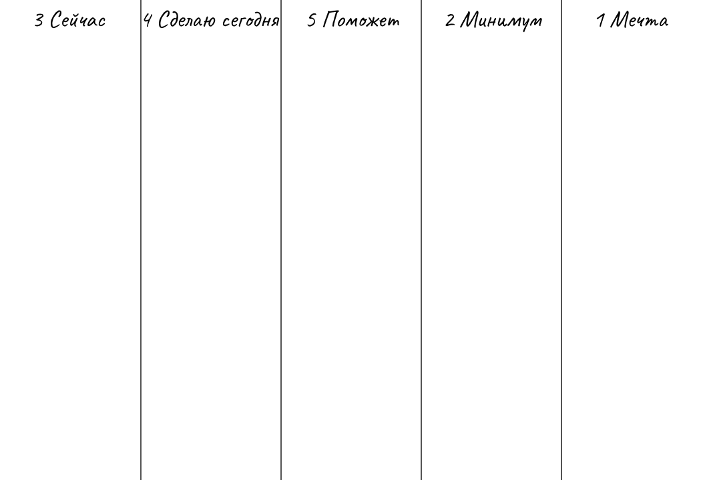

## Практика работы с Мечтой Андрея Мутонина
Такую таблицу работы можно нарисовать на листе А4 или сделать на компьютере.

1. Рисуем пять столбиков
2. В пятом столбике пишем Мечта и расписываем там свою мечту во всех красках, какой мы ее хотим получить.
3. В четвертом столбике пишем Минимум. Что нам минимально нужно для воплощения этой мечты. Ресурсы, вещи, деньги, люди, обстоятельства или что-нибудь еще. 
4. Теперь идем к первому столбику и пишем Сейчас. Расписываем, что у нас есть сейчас, для воплощения нашей мечты.
5. Во втором столбике пишем Сделать Сегодня. Записываем, что мы сделаем сегодня для воплощения своей мечты.
6. И в последнем третьем столбике пишем Помощь. Расписываем, что нам может помочь сегодня реализовать нашу мечту.

Такая таблица поможет вам продвинуться в воплощении вашей мечты. Хорошего дня!

© 2024 Андрей Мутонин
